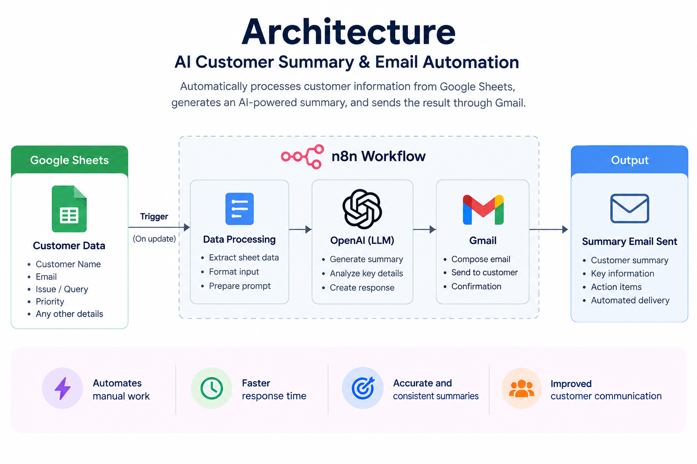
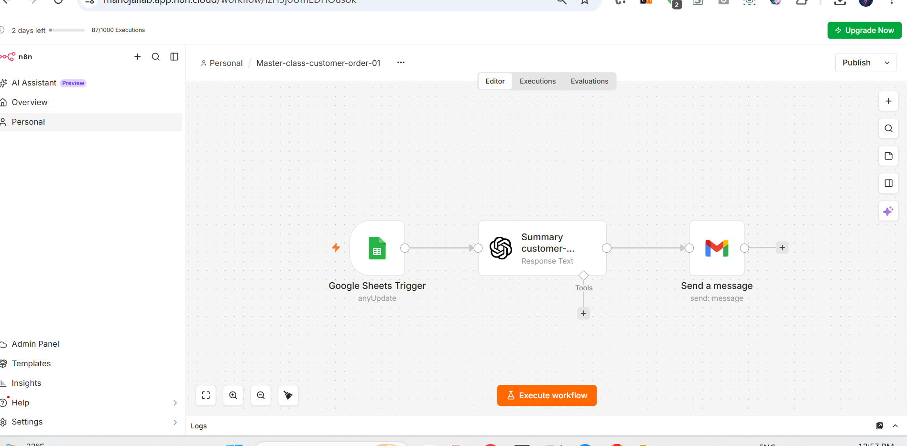

# AI Customer Summary & Email Automation

AI-powered business workflow that automatically processes customer information from Google Sheets, generates an LLM-powered summary, and sends the result through Gmail.

## 🎯 Problem

Customer information stored in spreadsheets often requires manual review and communication, creating repetitive work and slowing down response times.

## 💡 Solution

This workflow automates the process using n8n and an LLM.

**Workflow:**

Google Sheets → n8n → OpenAI → Customer Summary → Gmail

## 🏗️ Architecture



## 🔄 Workflow



## 🔄 Video

![n8n Video]

https://drive.google.com/file/d/1SoKim5XZQ-Ex9YhLOFdWQo5ICvKiwuIi/view?usp=sharing

## 🤖 AI Capabilities

- LLM integration
- Prompt engineering
- Customer information summarization
- Structured data processing

## ⚙️ Automation

- Event-driven workflow
- Google Sheets integration
- Gmail integration
- API orchestration
- Automated email notification

## 🧰 Tech Stack

- n8n
- OpenAI API
- Google Sheets
- Gmail
- JSON
- REST APIs

## 🧠 Skills Demonstrated

- Generative AI
- Large Language Models (LLMs)
- OpenAI API
- Prompt Engineering
- n8n Workflow Automation
- Event-Driven Automation
- API Integration
- Google Sheets Integration
- Gmail Integration
- JSON Data Processing
- Workflow Orchestration
- Business Process Automation

## 📂 Repository Structure

```text
.
├── workflow/
│   └── customer-summary-email.json
├── docs/
│   ├── architecture.png
│   └── workflow.png
├── prompts/
│   └── customer-summary.md
├── examples/
│   ├── input.json
│   └── output.json
├── .env.example
├── .gitignore
└── README.md